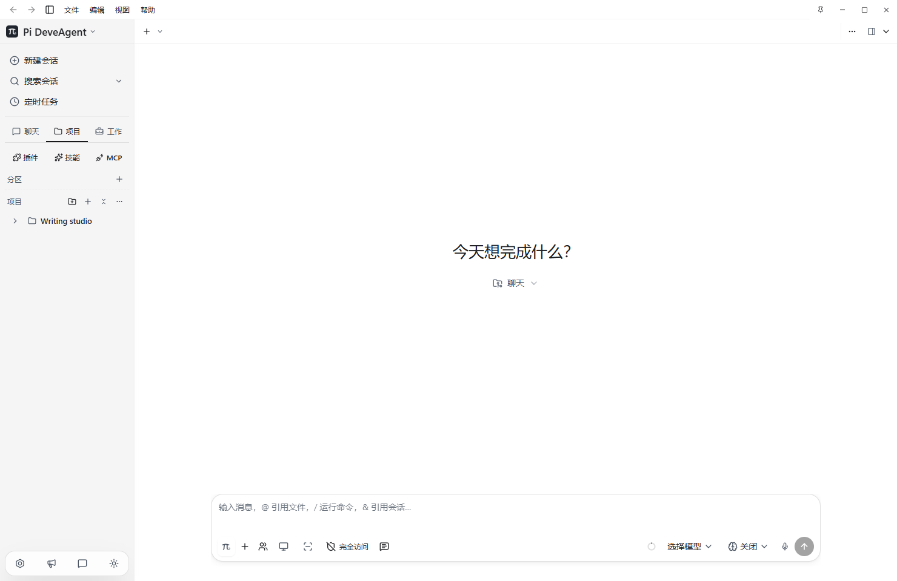
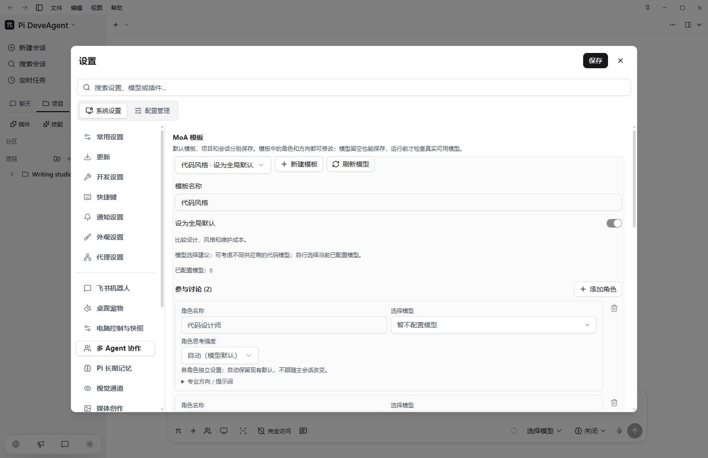

# Pi Deve Agent

**让 AI 跟上你的工作。**

围绕官方 Pi 核心独立演进的桌面工作台。写作、办公、开发，在同一个地方继续。

[产品主页](https://deveuper.github.io/Pi-DeveAgent/) · [下载](https://github.com/deveuper/Deveuper.github.io/releases) · [公开网站仓库](https://github.com/deveuper/Deveuper.github.io/tree/main/Pi-DeveAgent)

Windows x64 · MIT · 软件界面：简体中文 / English

## 你的工作台，你的模型

| 能力 | 怎样使用 |
|---|---|
| **独立的 Pi 核心** | 官方 Pi 通过独立进程运行，核心、工作台和扩展分别维护与更新；保留自己的 API、会话和工作配置。|
| **MoA 多 Agent 协作** | 让多个模型参与方案、审查、决策与实施；角色模型和思考强度独立，支持项目、会话与全局模板。|
| **国内外 API 预设** | 选择服务商预设，或配置兼容接口与自有反代；账号与密钥始终由用户提供。|
| **会话兜底模型** | 按会话指定备用模型；支持的服务错误后尝试接续，不确定的工具状态先暂停。|
| **本地模型管理** | 按需发现和连接 llama.cpp、Ollama、LM Studio；管理启动、参数与模型。llama.cpp 可导入 BAT 配置、管理受支持的视觉/推测解码参数与受管更新。|
| **上下文与长期记忆** | 支持长期指令编辑、导入和导出，以及可选上下文与记忆扩展。|
| **语音输入** | 真实麦克风波形，停止后转写到输入栏；可用本地语音或用户配置的服务。|
| **Skill、插件、提示词与 MCP** | 独立安装、启用和管理资源，通过商店发现内容；电脑控制是可以卸载的外置扩展。|
| **对话与产物相连** | 分区、项目、会话、置顶与历史跳转；各会话保留自己的模型和思考设置。右侧预览 HTML、PDF、图片、音视频与表格文本，其他文件可外部打开。|
| **适合长时间使用的主题** | 黑白、牛皮纸、护眼绿、柔粉、雾紫等主题，支持颜色强度调整。|

## 下载与开始

在[公开发行页](https://github.com/deveuper/Deveuper.github.io/releases)下载完整 Windows x64 包，选择空目录解压安装，再配置自己的模型服务。公开包不含个人 API、认证、模型配置或会话；每次发布均独立检查并提供 SHA256。本地语音附带 SenseVoice INT8 资源及其许可。

软件源代码仓库当前为私有；公开网站仓库只包含产品介绍与审核后的下载资产。当前以 Windows x64 为验证平台，不把其他平台源码视为已发行。

MoA 的输出质量、速度与费用由任务和模型决定，不承诺固定比例的 Token 节省。API 服务会收到任务所需的请求内容；电脑扩展是否安装、是否启用和会话审批分别控制。

## 多语言产品介绍

网站提供 **15 种介绍语言**，默认中文，英文第二；**软件本身目前只有简体中文与英文**。

[简体中文](https://deveuper.github.io/Pi-DeveAgent/?lang=zh-CN) · [English](https://deveuper.github.io/Pi-DeveAgent/?lang=en) · [繁體中文](https://deveuper.github.io/Pi-DeveAgent/?lang=zh-TW) · [日本語](https://deveuper.github.io/Pi-DeveAgent/?lang=ja) · [한국어](https://deveuper.github.io/Pi-DeveAgent/?lang=ko) · [Français](https://deveuper.github.io/Pi-DeveAgent/?lang=fr) · [Deutsch](https://deveuper.github.io/Pi-DeveAgent/?lang=de) · [Español](https://deveuper.github.io/Pi-DeveAgent/?lang=es) · [Português](https://deveuper.github.io/Pi-DeveAgent/?lang=pt) · [Italiano](https://deveuper.github.io/Pi-DeveAgent/?lang=it) · [Русский](https://deveuper.github.io/Pi-DeveAgent/?lang=ru) · [العربية](https://deveuper.github.io/Pi-DeveAgent/?lang=ar) · [हिन्दी](https://deveuper.github.io/Pi-DeveAgent/?lang=hi) · [Bahasa Indonesia](https://deveuper.github.io/Pi-DeveAgent/?lang=id) · [Tiếng Việt](https://deveuper.github.io/Pi-DeveAgent/?lang=vi)

## 本轮修复

项目创建与编辑支持图标、颜色、主文件夹和参考文件夹；已有会话保留原目录。视图可在项目目录打开 Pi、Codex 和 Claude Code 终端，帮助提供可跳过的新手教程。网站在浏览时直接展示滚动联动、架构连线、能力卡展开与配色切换动效；十二种真实软件配色预览与网页的黑白模式独立切换。历史修复和个人配置继续保留。

## English

An independent desktop workspace around the official Pi core. Organize projects and conversations, connect your own API or local models, and coordinate multiple agents through editable MoA roles. The shell adds voice transcription, artifact previews, session fallback models and optional tool ecosystems while maintaining separate core and extension updates.

The desktop currently supports **Simplified Chinese and English**. The product website offers **15 introduction languages** and twelve actual software color previews, independent of the website's light/dark mode. Projects support custom icons and primary/reference folders. Open installed Pi, Codex or Claude Code terminals in the project folder, and reopen the skippable starter guide from Help. Download audited Windows x64 packages from the public release page; provide your own credentials. Computer control is an optional, removable external extension. Model quality and token savings are task-dependent.

## 许可与参考来源

本产品在 MIT 许可基础上维护。原有许可和必要版权声明保留于 [LICENSE](LICENSE) 与 [THIRD-PARTY-NOTICES.md](THIRD-PARTY-NOTICES.md)。依赖、插件和模型分别遵守各自的许可。

[参考来源](https://deveuper.github.io/Pi-DeveAgent/references.html)包括 Pi、PiDeck、Pi Agent Desktop、PI-Desktop、Pi Desktop、Hermes Agent 与 DeepSeek Harness。参考不表示合作或背书。
